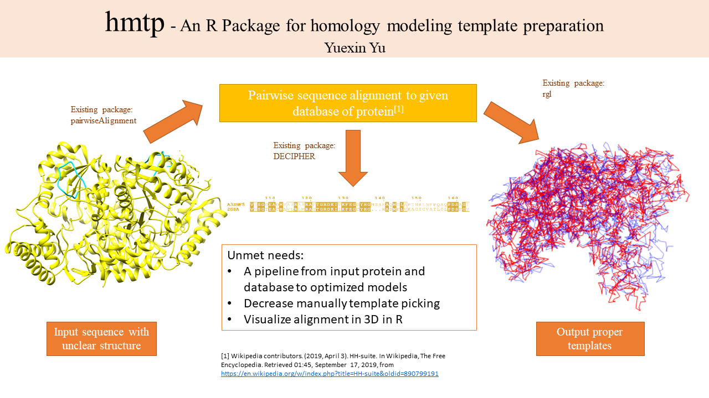

# hmtp

<!-- badges: start -->
<!-- badges: end -->

The goal of hmtp is to prepare templates for homology modeling. This package can pick out less than 5 best protein sequences that can do homology modling with target sequence as templates from given database based on pairwise alignment. The alignment files for picked templates and target protein, and pdb file of templates are generated/downloaded to users for homology modeling. This package also provide a rough visualization of how similar two provided aligned proteins are in both 1D and 3D.    

## Installation

You can install the released version of hmtp from github with:

``` r
library(devtools)
install_github("MichelleMengzhi/hmtp")
library(hmtp)
```

## Overview

An overview of the package is illustrated below.



This package contains two main functions:
**selectTemplates** which selects templates for the target in the later homology modeling and gets their pdb files and alignment file, **alignment3dVisualization** whcih provides a visualization of how similar the template and target sequences are in 3D, helper functions *crossReferenceList*, *GetPdbFileGenerator*, *pathGeneratorMovement*, which contribute in main functions but can also be used separately.

## Contribution

The author of the package is Yuexin Yu. 

In **selectTemplates** function, [Biostrings](https://www.bioconductor.org/packages/devel/bioc/manuals/Biostrings/man/Biostrings.pdf), [DECIPHER](https://bioconductor.org/packages/release/bioc/html/DECIPHER.html) packages are imported for capturing protein sequences from fasta file and 1D visualization respectively. Yuexin Yu built up the filter to capture information for pairwise alignment, the html download of selected pdb files, and the generation of alignment files for later homology modeling.   

In **alignment3dVisualization** function, [rgl](https://cran.r-project.org/web/packages/rgl/rgl.pdf) package is used to help to generate a line plot graph. Yuexin Yu built up the filter to capture the xyz coordinates from the input and output a 3D image which plots two set od data and line all points all to generate a rough 3D structure of proteins. 

